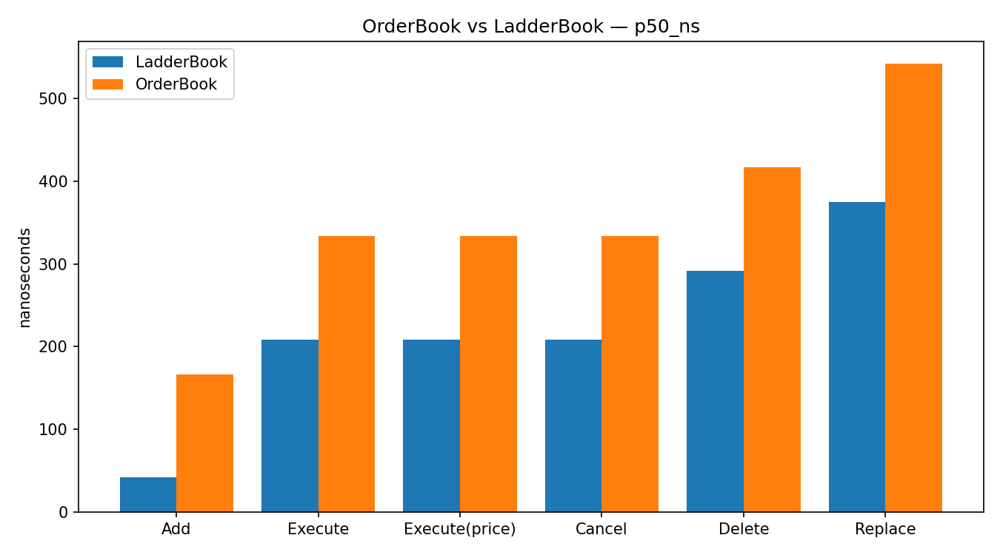
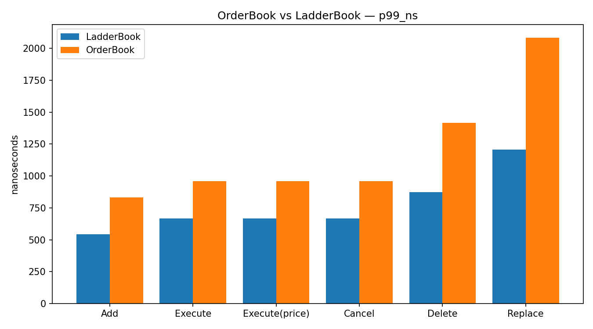
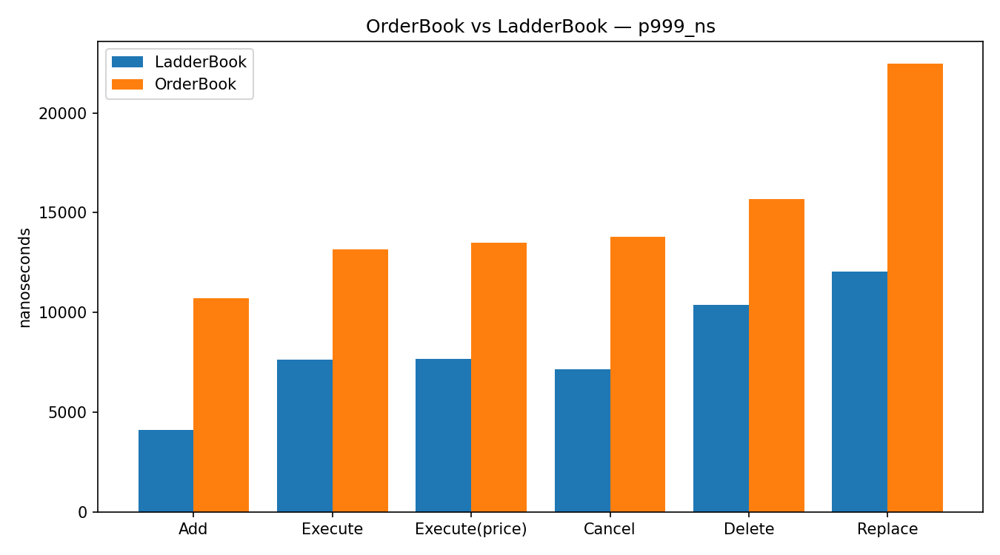

# itch-lob-engine

[](https://github.com/Manav0559/itch-lob-engine/actions/workflows/ci.yml)
[](https://en.cppreference.com/w/cpp/20)
[](LICENSE)

A NASDAQ TotalView-ITCH 5.0 order-book reconstruction engine in C++20.

Parses the real exchange binary protocol (length-prefixed `BinaryFILE`
framing, big-endian wire integers, 48-bit nanosecond timestamps), rebuilds the
full limit order book per symbol from individual order events
(add / execute / cancel / delete / replace), and replays complete trading
days.

**Project rule: every number in this README is produced by a committed target
you can run.** The numbers below come from `./build/bench` (see
[bench/](bench/)) on an Apple M2 (arm64, macOS 26.1), `-O2`, AppleClang 17 —
a fixed-seed synthetic 2.2M-message session across 9 symbols, one discarded
warm-up pass + 3 measured passes. Regenerate with:

```bash
cmake --build build --target bench && ./build/bench && python3 bench/plot.py
```

## Status

- [x] ITCH 5.0 stream framing (2-byte length prefix; unknown/corrupt frames
      skipped by length — the stream can never desynchronize)
- [x] Decoders for the book-building set: `A F E C X D U`, byte-offset exact,
      round-trip tested against mirror encoders
- [x] Order-id book: hash-map locator + price-level aggregates, `std::map`
      ladders (deliberate v1 baseline)
- [x] Unit tests (Catch2) incl. the classic footguns: phantom empty levels,
      duplicate refs, over-executes on feed gaps, truncated tails
- [x] CI on Linux + macOS, `-Wall -Wextra -Wpedantic -Werror`
- [x] Execution strategies: Twap (time-sliced), Vwap (elapsed-time-weighted,
      tape-reactive), Pov (percentage-of-volume) — header-only, allocation-free,
      no floating point, share the same compile-time-dispatched
      `ExecutionStrategy` interface
- [x] `mmap` input path for large uncompressed day files; gzip-streaming input
      path (chunked `inflate`, carries partial frames across chunk boundaries)
      for compressed day files
- [x] Flat tick-ladder book (`LadderBook`), a drop-in alternative to `OrderBook`
      with the identical interface and correctness bar
- [x] `LadderBook` vs. `OrderBook` benchmarked head-to-head: `./build/bench`,
      p50/p99/p99.9 per message type, committed CSV + plots (see table below
      and [bench/](bench/))
- [x] **`LadderBook` is the production default**, not just a benchmark
      exhibit: `replay`/`replay_threaded` route every message through a
      dense, locate-indexed `pipeline::BookTable` (`include/pipeline/
      book_table.hpp`) backed by `LadderBook` by default — pass `--map` to
      force the `std::map`-based `OrderBook` instead, for an explicit A/B.
      Wiring this up surfaced (and fixed) a real bug: `LadderBook`'s tick-grid
      alignment wasn't anchored consistently, which would have silently
      merged distinct real price levels once fed actual exchange data instead
      of grid-perfect synthetic prices — see
      [docs/devlog-orderbook-vs-ladderbook.md](docs/devlog-orderbook-vs-ladderbook.md).
- [x] Full-day invariant suite: a synthetic trading day replayed through
      `OrderBook`, `LadderBook`, and an independent from-scratch reference
      model, cross-checked against each other at every 250-message checkpoint
      (`tests/test_full_day_invariants.cpp`)
- [x] Execution fill simulation (`exec::FillSimulator`): scores Twap/Vwap/Pov's
      `ChildOrder`s against a replayed quote/tape (realized fill price, VWAP,
      fill rate) — see the scope notes in `include/exec/fill_sim.hpp` for what
      this lightweight model does and doesn't model (no resting/partial fills)
- [x] Multi-threaded pipeline (`replay_threaded`): parsing and book-building
      decoupled onto separate threads joined by a lock-free SPSC queue
      (`include/pipeline/spsc_queue.hpp`), instead of one thread doing both —
      produces identical book state to `replay` (now checked against both
      `OrderBook` and `LadderBook` — `tests/test_replay_threaded.cpp`), and
      reports max queue occupancy as a backpressure indicator.
      **Original finding** (measured against `OrderBook`, before `LadderBook`
      became the default): throughput within noise of single-threaded
      (0.75–1.03x across runs) and a real latency regression under load — see
      [bench/THREADED_PIPELINE_FINDINGS.md](bench/THREADED_PIPELINE_FINDINGS.md).
      **Open question, not yet resolved**: now that `LadderBook` (much
      cheaper per-message book mutation) is what both paths default to, a
      fresh `./build/bench_threaded` run showed the threaded pipeline
      *ahead* of single-threaded (~1.03–1.2x depending on pass) — the
      opposite of the original verdict. That single noisy run (this machine
      runs benchmarks alongside real background load) is not enough to
      overturn a documented conclusion; it needs the same rigor the original
      finding got (multiple runs, ideally with CPU core pinning — see the
      roadmap) before `THREADED_PIPELINE_FINDINGS.md` gets rewritten.
- [x] Live UDP multicast feed handler (`live_replay` + `multicast_sender`): a
      scoped proof-of-concept of how real ITCH is actually delivered
      (multicast, not files) — deliberately not a MoldUDP64 implementation;
      see `include/net/multicast_receiver.hpp` for the explicit scope boundary
- [x] Almgren-Chriss optimal-execution strategy (`include/exec/almgren_chriss.hpp`):
      a risk-averse, front-loaded trade trajectory alongside Twap/Vwap/Pov's
      simpler schedules
- [x] CI-enforced performance budget (`bench/check_budget.py`): a same-run
      ratio gate (LadderBook must stay meaningfully faster than OrderBook)
      that's robust to noisy CI machines, plus an informational drift warning
      against rolling CI history — see `bench/BUDGET.md`
- [x] Cross-platform hardware-counter profiling (`bench/hw_profile.sh`):
      `perf stat` on Linux, an honest smaller subset (`/usr/bin/time -l`) on
      macOS where userspace PMU access isn't available — see
      `bench/HARDWARE_PROFILING.md`
- [x] [Devlog: OrderBook vs. LadderBook](docs/devlog-orderbook-vs-ladderbook.md) —
      the tree-vs-array tradeoff, written up with the real measured numbers
- [x] Pre-trade risk gate (`include/exec/risk_gate.hpp`): per-order size /
      notional / price-collar limits plus a latching cumulative kill switch
      (requires an explicit `reset()` — no automatic self-healing) between a
      strategy's `ChildOrder` output and wherever orders go next
- [x] Coverage-guided fuzzing of the ITCH parser (`fuzz/`): libFuzzer +
      ASan/UBSan against `itch::parse_stream` through a real `BookBuilder`
      (`LadderBook`-backed, the same default production now uses), not
      just decode-in-isolation — 4.6M+ executions across seed runs, clean, no
      crashes found so far; see [fuzz/README.md](fuzz/README.md)

## Design notes

- **Framing before parsing.** The walker trusts only the 2-byte length
  prefix, so message types this engine doesn't decode (or future spec
  additions) are skipped, not tripped over. A known type arriving with the
  wrong length is surfaced as corrupt — never misparsed.
- **Locator + aggregates.** ITCH executes/cancels/deletes reference the order
  id, never the price. Per-order state therefore lives in an
  `unordered_map<ref, {shares, price, side}>`; the ladders only carry
  per-level `{shares, order count}`. Empty levels are erased immediately —
  a phantom level corrupts best-bid/ask and depth, and there is a regression
  test for exactly that.
- **`std::map` first, on purpose.** The interesting claim was never "arrays
  are faster than red-black trees" in the abstract — it's *by how much*,
  measured on the same byte-identical stream through both implementations.
  `LadderBook`'s O(1) indexed lookup beats `OrderBook`'s O(log levels) tree
  work across every message type, and the gap widens sharply in the tail:

  | type | OrderBook p50 | LadderBook p50 | OrderBook p99.9 | LadderBook p99.9 |
  |------|--------------:|---------------:|----------------:|-----------------:|
  | A    | 166 ns        | 42 ns          | 10,709 ns       | 4,125 ns         |
  | E    | 334 ns        | 208 ns         | 13,166 ns       | 7,625 ns         |
  | C    | 334 ns        | 208 ns         | 13,500 ns       | 7,666 ns         |
  | X    | 334 ns        | 208 ns         | 13,792 ns       | 7,167 ns         |
  | D    | 417 ns        | 292 ns         | 15,667 ns       | 10,375 ns        |
  | U    | 542 ns        | 375 ns         | 22,458 ns       | 12,042 ns        |

  
  
  

  Full distributions and plots: [bench/results.csv](bench/results.csv),
  [bench/plots/](bench/plots/) (regenerate with `python3 bench/plot.py`
  after any `./build/bench` run — requires `pip install matplotlib`).
  `std::map`'s tail is dominated by
  red-black-tree rebalancing on insert/erase; `LadderBook` pays a fixed
  array-index cost regardless of how full the book is, at the cost of a
  bounded price window fixed at construction (see `include/book/ladder_book.hpp`).
  Regenerated after `LadderBook` became the production default (see the
  `pipeline::BookTable`/`BookBuilder` entry above) — absolute numbers move
  run to run with this machine's background load (the project's own
  single-run-no-warmup caveat, and why `bench/check_budget.py`'s CI gate is a
  same-run ratio check, not an absolute one), but the ratio between the two
  books is the reproducible, load-bearing part of this table.

## Build & test

```bash
cmake -B build -DCMAKE_BUILD_TYPE=Release
cmake --build build --parallel
ctest --test-dir build --output-on-failure
```

Run the pipeline end-to-end without any data file:

```bash
./build/replay --selftest
```

## Replaying a real trading day

NASDAQ publishes free full-day sample files (several GB gzipped, ~13 GB
uncompressed — plan disk accordingly):
<https://emi.nasdaq.com/ITCH/Nasdaq%20ITCH/>

```bash
./build/replay 12302019.NASDAQ_ITCH50.gz   # streams the gzip directly, chunk by chunk
./build/replay 12302019.NASDAQ_ITCH50      # mmaps an already-uncompressed file
```

Either path avoids materializing the full day in memory before parsing: `.gz`
files are inflated in fixed-size chunks and dispatched to the parser as they
decompress, and `.NASDAQ_ITCH50` files are mapped read-only rather than read
into a heap buffer. `./build/replay --legacy <file>` keeps the original
whole-file-into-memory path for A/B comparison on small files.

The replay reports frames parsed, per-type counts, books built, open orders,
and unknown-ref counts (which should be zero on an intact file from the start
of day).

## Other binaries

```bash
./build/replay_threaded --selftest   # same replay, parser + book-builder on separate threads
```

`replay_threaded` accepts the same `<file>` / `--legacy <file>` / `--selftest`
arguments as `replay` and produces identical book state — it's a comparison
binary for the decoupled-pipeline design, not a replacement, and additionally
reports max SPSC queue occupancy as a backpressure indicator.

```bash
./build/live_replay 239.255.0.1 12345 5 &     # join a multicast group, report every 5 frames
./build/multicast_sender 239.255.0.1 12345    # send a synthetic session to it
```

A scoped proof-of-concept of live delivery (real ITCH is distributed over UDP
multicast, wrapped in NASDAQ's MoldUDP64 session protocol) — this demo
assumes no packet loss and skips MoldUDP64's sequencing/gap-fill, which is
explicitly out of scope; see `include/net/multicast_receiver.hpp`.
`live_replay` runs until interrupted (Ctrl-C / `SIGINT`) since a live feed has
no natural end.

## License

MIT
