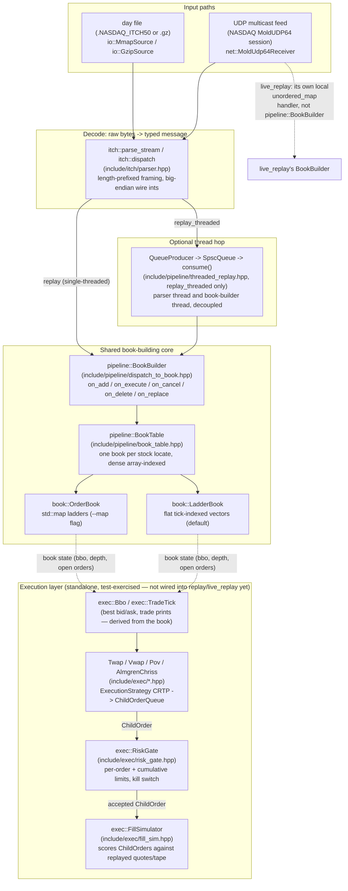

# Architecture

One page, meant to be read in under 10 minutes: what this engine does, the
two ways data enters it, and where each of the ~15 files under `include/`
sits in the flow. The README's Status list documents *what's been built and
measured*; this doc is the map you'd want before reading any of it — start
here, then go to the README for the numbers and `docs/devlog-orderbook-vs-
ladderbook.md` for the one big design tradeoff written up in full.

## What this is, in one paragraph

A NASDAQ TotalView-ITCH 5.0 feed handler: it decodes the exchange's real
binary wire protocol into typed messages (`itch::parse_stream` /
`itch::dispatch`), replays them into a live limit order book per stock
symbol (`BookBuilder` routing into `OrderBook` or `LadderBook`, one per
`stock locate`), and — as a separate, currently-standalone layer exercised
by its own tests — can schedule and risk-check child orders
(Twap/Vwap/Pov/Almgren-Chriss → `RiskGate` → `FillSimulator`) against the
quotes and prints that book produces. Two independent input paths (file
replay and live UDP multicast) feed the same book-building core; two book
implementations (`std::map`-based and flat-array-based) share the identical
interface behind that core, swappable with one command-line flag.

## Data flow



If your renderer doesn't do Mermaid, here's the same shape as plain text:

```
 day file (.gz / mmap)                 UDP multicast (MoldUDP64)
        |                                        |
        v                                        v
 itch::parse_stream/dispatch              net::MoldUdp64Receiver
 (include/itch/parser.hpp)                 -> itch::dispatch
        |                                        |
        | replay: same thread                    | live_replay: its own local
        | replay_threaded: SPSC queue             | BookBuilder (unordered_map
        | to a 2nd thread                         | <locate, OrderBook>) --
        v                                         | see "Live path" below
 pipeline::BookBuilder::on_add/on_execute/on_cancel/on_delete/on_replace
        |
        v
 pipeline::BookTable<BookType>   (one book per stock locate, array-indexed)
        |
        +--> book::OrderBook   (std::map ladders,   --map flag, the A/B baseline)
        +--> book::LadderBook  (flat tick vectors,   default, production choice)
        |
        v  (bbo / trade prints read off the book)
 exec::Bbo, exec::TradeTick
        |
        v
 Twap / Vwap / Pov / AlmgrenChriss  (ExecutionStrategy -> ChildOrderQueue)
        |
        v
 exec::RiskGate   (per-order + cumulative limits, latching kill switch)
        |
        v
 exec::FillSimulator   (scores ChildOrders against the replayed quote/tape)
```

## Entry points, and which parts of the diagram each one exercises

| Binary | Source | Path through the diagram |
|---|---|---|
| `./build/replay` | `src/replay_main.cpp` | file (mmap or gzip-stream) → `itch::parse_stream` → `pipeline::BookBuilder` → `pipeline::BookTable<BookType>` directly, one thread. `BookType` defaults to `LadderBook`; `--map` swaps in `OrderBook`. |
| `./build/replay_threaded` | `src/replay_threaded_main.cpp`, `include/pipeline/threaded_replay.hpp` | same file input and same `BookBuilder`/`BookTable` core as `replay`, but the parser and the book-builder run on separate threads joined by a lock-free `SpscQueue<Envelope>` (`include/pipeline/spsc_queue.hpp`); `dispatch_to_book` re-applies an `Envelope` decoded on the parser thread into the book on the consumer thread. Produces identical book state to `replay` — see `tests/test_replay_threaded.cpp`. |
| `./build/live_replay` | `src/live_replay_main.cpp`, `include/net/multicast_receiver.hpp` | UDP multicast → `net::MoldUdp64Receiver` (session header, sequence-gap detection, retransmission-request round trip) → `itch::dispatch` → **its own local `BookBuilder`** over `std::unordered_map<locate, book::OrderBook>`. This is the one place in the diagram that does *not* go through `pipeline::BookBuilder`/`BookTable` or `LadderBook` — it predates that shared abstraction and hasn't been migrated onto it yet (a good next-step consolidation, not a hidden bug). |
| `./build/multicast_sender` | `src/multicast_sender_main.cpp` | not a book-building path at all — a `MoldUdp64Sender` that replays a synthetic session onto the multicast group `live_replay` joins, and answers its retransmission requests. Exists to exercise `live_replay` without a real feed. |
| `./build/bench`, `./build/bench_threaded` | `bench/bench_main.cpp`, `bench/bench_threaded_main.cpp` | drive the exact same `BookBuilder`/`BookTable` (and, for the threaded one, `pipeline::run_pipeline`) core as `replay`/`replay_threaded` against a synthetic in-memory session, so the benchmarked code path and the production path are provably the same code, not two implementations that happen to agree. |

## The book swap point

`pipeline::BookTable<BookType>` and `pipeline::BookBuilder<BookType>`
(`include/pipeline/dispatch_to_book.hpp`) are the one place `OrderBook` and
`LadderBook` are interchangeable: both expose the identical
`add/execute/cancel/remove/replace` interface, so `BookTable` — and
everything upstream of it (the parser, the threaded queue, the benchmarks)
— is written once, generic over `BookType`, and never needs to know which
book backend it's holding. `BookTraits<BookType>` is the one customization
hook: `OrderBook` is default-constructible, `LadderBook` needs a price
window sized off the first `A` message's price (see the specialization in
`dispatch_to_book.hpp`), and that's the only difference `BookTable` has to
account for. `LadderBook` is the default in both `replay` and
`replay_threaded`; `--map` is the explicit, always-available A/B switch back
to `OrderBook`. See `docs/devlog-orderbook-vs-ladderbook.md` for why both
exist and what the measured tradeoff actually is.

## Where exec/risk/fill sit, and what "sit" means today

`include/exec/*.hpp` (execution strategies), `risk_gate.hpp`, and
`fill_sim.hpp` are real, tested, header-only modules — Almgren-Chriss,
Twap, Vwap, and Pov all implement the same `ExecutionStrategy` CRTP
interface and push `ChildOrder`s into a fixed-capacity `ChildOrderQueue`;
`RiskGate` is the documented, intended checkpoint between that queue and
"wherever orders go next" (its own header comment names `FillSimulator` in
this codebase, an OMS in a live one); `FillSimulator` scores those orders
against a replayed `Bbo`/`TradeTick` stream. What they are *not*, as of this
writing, is wired into `replay`/`replay_threaded`/`live_replay` end to end —
each is exercised by its own focused test suite
(`tests/test_exec_*.cpp`, `tests/test_risk_gate.cpp`,
`tests/test_fill_sim.cpp`), not by a binary that reads book state and drives
a strategy live off of it. The diagram's dashed arrow from the book to
`exec::Bbo`/`TradeTick` marks that boundary honestly: the data shape lines
up (both are plain, trivially-copyable structs a book could push on every
change) but no code in `src/` or `bench/` currently does that pushing. Closing
that gap — a `replay` mode that feeds a live book's quotes into a strategy
into the risk gate into the fill simulator — is the natural next
architectural step, not something this diagram should pretend already
exists.

## File map

```
include/
  itch/       messages.hpp (wire structs), parser.hpp (dispatch/parse_stream), encode.hpp (test/fuzz mirror encoders)
  io/         mmap_source.hpp, gzip_source.hpp — how a day file's bytes reach the parser
  net/        moldudp64.hpp, multicast_receiver.hpp, multicast_test_sender.hpp — the live UDP path
  book/       order_book.hpp (std::map), ladder_book.hpp (flat array) — identical interface, see architecture note above
  pipeline/   book_table.hpp, dispatch_to_book.hpp, message.hpp, spsc_queue.hpp, threaded_replay.hpp, thread_affinity.hpp
              — the shared book-building core and the threaded variant's plumbing
  exec/       types.hpp, execution_strategy.hpp, twap/vwap/pov/almgren_chriss.hpp, volume_curve.hpp, risk_gate.hpp, fill_sim.hpp
              — strategy -> risk -> fill layer described above
src/          replay_main.cpp, replay_threaded_main.cpp, live_replay_main.cpp, multicast_sender_main.cpp — the four binaries
bench/        bench_main.cpp, bench_threaded_main.cpp, synthetic_session.hpp — reuse the same core against a synthetic session
tests/        one file per component; test_full_day_invariants.cpp cross-checks OrderBook, LadderBook, and an independent
              reference model against each other across a whole synthetic day
dashboard/    static HTML viewer for the committed bench/*.csv results (see dashboard/README.md)
```
